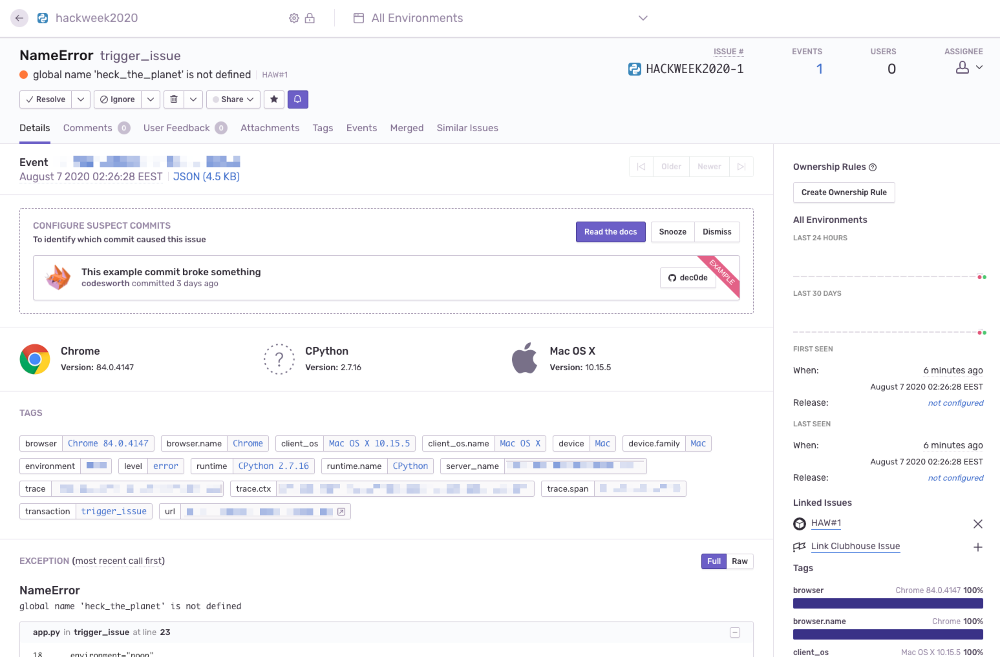
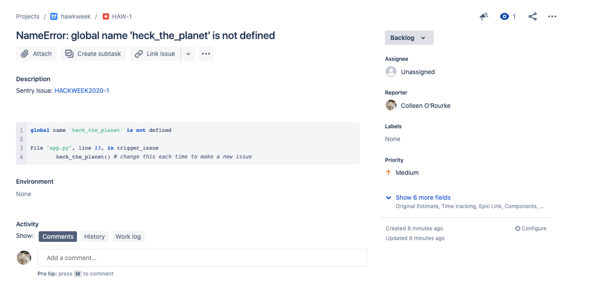

Automatically creates a Jira ticket when a Sentry issue is created, whether you like it or not.

To use this you must:

* Create a Sentry internal integration: https://docs.sentry.io/workflow/integrations/integration-platform/#creating-an-integration
	* Permissions: read access on "Issue & Event", read access on "Organization"
	* Webhook: "issue"
	* Schema: 
	```
		{
	  "elements": [
	    {
	      "type": "issue-link",
	      "create": {
	        "required_fields": [
	          {
	            "type": "text",
	            "name": "title",
	            "label": "Title"
	          }
	        ],
	        "uri": "/"
	      },
	      "link": {
	        "required_fields": [
	          {
	            "type": "text",
	            "name": "title",
	            "label": "Title"
	          }
	        ],
	        "uri": "/"
	      }
	    }
	  ]
	}
	```
* Get a Jira API token: https://id.atlassian.com/manage/api-tokens

For this project (which is a just an example of functionality), when you load your web server's main page (e.g. your-subdomain.ngrok.io) it will trigger
a Sentry issue. To trigger more, just change the non-existent function being called in `trigger_issue` so that 
a different Sentry issue is created, because the internal integration is listening for an issue being created at which point it will create
a Jira ticket. Probably you have actual code to run this on though. The Jira project key is currently hardcoded into the payload, so change that to yours unless for some reason it also happens to be `HAW`. Peep your Jira project to see the ticket that was created!

Look, I know you can't tell from these that I didn't just create the ticket manually but I promise I did not, otherwise this repo would be pointless.



